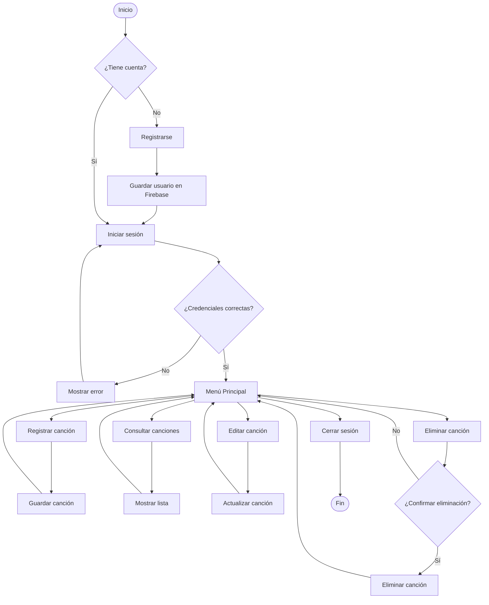

```mermaid

flowchart TD

A([Inicio])

A --> B{¿Tiene cuenta?}

B -- No --> C[Registrarse]
C --> D[Guardar usuario en Firebase]
D --> E[Iniciar sesión]

B -- Sí --> E

E --> F{¿Credenciales correctas?}

F -- No --> G[Mostrar error]
G --> E

F -- Sí --> H[Menú Principal]

H --> I[Registrar canción]
H --> J[Consultar canciones]
H --> K[Editar canción]
H --> L[Eliminar canción]
H --> M[Cerrar sesión]

I --> N[Guardar canción]
N --> H

J --> O[Mostrar lista]
O --> H

K --> P[Actualizar canción]
P --> H

L --> Q{¿Confirmar eliminación?}

Q -- Sí --> R[Eliminar canción]
R --> H

Q -- No --> H

M --> S([Fin])

```

